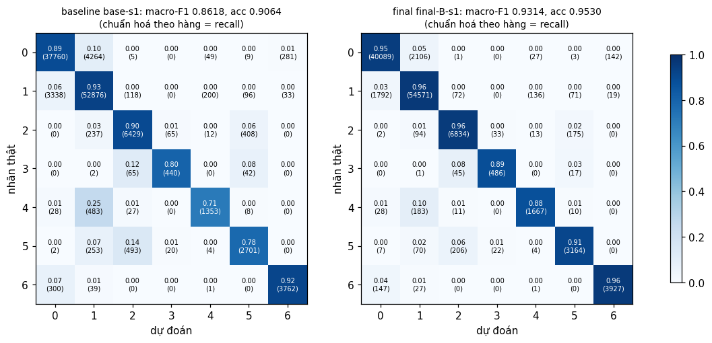

# Báo cáo Lab Day 1 — Nguyễn Hoàng Sơn — 2A202602457

Mọi con số dưới đây lấy từ `experiments.xlsx` (trỏ bằng `exp_id`) và `eval_result.json`. So sánh dùng **val macro-F1 tại epoch có val loss thấp nhất**; "vượt nhiễu" nghĩa là |Δ| so với trung bình baseline lớn hơn 2σ = 0,0037 (mục 2).

## 1. Thiết lập

- Môi trường: Google Colab, GPU Tesla T4, PyTorch 2.11.0+cu130. Toàn bộ dữ liệu nằm trên GPU, tự xáo bằng `torch.randperm` mỗi epoch (không DataLoader).
- Dữ liệu: Forest CoverType; `train` 464 809 / `eval` 116 203 theo `split_metadata.csv`. Validation: 20% của train (phân tầng, seed 42) → 371 847 train / 92 962 val. Chuẩn hoá 10 cột số bằng mean/std của 371 847 mẫu train (mean ≈ 0, std ∈ [0,9998; 1,0008]); 44 cột nhị phân giữ nguyên. Tỉ lệ lớp ở train/val/eval trùng nhau tới 0,01%.
- Model: `M-base` (54→256→128→7, 47 879 tham số, có `assert`). Baseline: CE, SGD+momentum 0,9, **lr = 0,1** (chọn bằng val), batch 512, 20 epoch, khởi tạo He (`kaiming_normal_`, bias = 0), dropout 0, không clip, FP32.
- Mốc tham chiếu: accuracy "đoán lớp đa số" trên val = **0,4876**.
- Train loss được đo ở chế độ `eval()` trên 50 000 mẫu train cố định; `grad_norm` là chuẩn L2 toàn cục **trước** khi clip.
- Các chủ đề đã thử: ☑ loss ☑ optimizer ☑ hyper-parameter ☑ dropout ☑ clipping ☑ mixed precision ☑ init (45 lần chạy, 45 ảnh `figures/<exp_id>.png`, 14 ảnh `compare_*.png`).

## 2. Kiểm tra ban đầu và độ nhiễu

| Kiểm tra | Kết quả |
|---|---|
| Số tham số / shape logits | 47 879 / (B, 7) |
| Loss bước 0 (so với ln 7 = 1,946) | 2,269 (`base-s1`); 1,978 (`base-s2`); 1,900 (`base-s3`) |
| Quá khớp 20 mẫu: loss cuối | 2,198 → 0,000177 sau 500 bước Adam, accuracy 100% |
| Mọi tham số có gradient khác 0 | ☑ có (‖grad‖ của W1…b3 từ 0,34 đến 2,02) |
| Baseline, số seed đã chạy | 3 (`base-s1..s3`) |
| Baseline: val acc (TB ± σ) | 0,9091 ± 0,0007 |
| Baseline: val macro-F1 (TB ± σ) | 0,8562 ± 0,0019 |

**Ngưỡng nhiễu dùng trong báo cáo:** 2σ = **0,0037** (val macro-F1, σ mẫu của 3 seed).

Loss bước 0 lệch khỏi ln 7 tới 0,3 với seed 1. Lý do là khởi tạo He giữ phương sai qua các lớp, nên ở bước 0 logit có std ≈ 0,58 chứ không ≈ 0, và giá trị này đổi theo seed. Với `init-zeros` và `init-normal` (logit ≈ 0), loss bước 0 đúng bằng 1,9459 và 1,9460, nên cách tính loss là đúng. Đường cong baseline (`base-s1.png`, `compare_baseline_seeds.png`): train và val loss cùng giảm đều tới epoch 20 (val 0,472 → 0,231). Best epoch là 20/20/19 và val − train chỉ ≈ 0,02. Vậy baseline **chưa quá khớp và chưa hội tụ**. `opt-sgdm-lr0.1` và `base-s1` cho đúng cùng một F1 (0,8584), nên pipeline tái lập được.

## 3. Kết quả theo chủ đề

### 3.1 Hàm mất mát — CE vs MSE
- **Dự đoán:** gradient của MSE theo logit là 2(z−y)/7, bị chặn và nhỏ, nên MSE sẽ học chậm hơn CE và kém nhất ở các lớp hiếm.
- **Kết quả** (`compare_loss.png`): `loss-mse` (lr 0,1) đạt F1 **0,7329**, acc 0,8713, kém baseline 0,123 (vượt nhiễu rất xa). `loss-mse-lrx3` (lr 0,3) đạt **0,7887**: tăng lr bù được một phần nhưng vẫn kém CE 0,068.
- **Giải thích:** grad_norm trung bình của MSE chỉ 0,087, so với 0,577 của CE. Gradient softmax(z)−y của CE không bão hoà khi dự đoán sai nặng. MSE làm macro-F1 giảm (−0,12) mạnh hơn accuracy (−0,04), tức các lớp hiếm chịu thiệt nhiều nhất. Tôi không so trực tiếp giá trị loss (MSE ≈ 0,03, CE ≈ 0,23) vì hai loss khác thang đo.

### 3.2 Bộ tối ưu hoá
- **Dự đoán:** SGD thuần cần lr lớn hơn khoảng 10 lần so với SGD+momentum. Adam/AdamW hội tụ nhanh hơn và có thể nhỉnh hơn ở lr tốt nhất. AdamW với wd = 0 phải trùng Adam.

| Bộ tối ưu | lr thử | lr tốt nhất | `exp_id` | val macro-F1 | best epoch |
|---|---|---|---|---|---|
| SGD | 0,03 / 0,1 / 0,3 | 0,3 | `opt-sgd-lr0.3` | 0,8008 | 19 |
| SGD+momentum 0,9 | 0,01 / 0,03 / 0,1 / 0,3 | 0,1 | `opt-sgdm-lr0.1` | 0,8584 | 20 |
| Adam (β=(0,9;0,999), ε=1e-8) | 3e-4 / 1e-3 / 3e-3 | 3e-3 | `opt-adam-lr0.003` | 0,8683 | 18 |
| AdamW (wd 0,01) | 3e-4 / 1e-3 / 3e-3 | 3e-3 | `opt-adamw-lr0.003` | **0,8757** | 20 |

- **Độ nhạy lr** (`compare_optimizer_lr.png`): SGD+momentum ổn định trong khoảng 0,1–0,3 (0,8584 / 0,8521). SGD thuần ở lr 0,3 vẫn kém SGD+momentum ở lr 0,03 (0,8008 vs 0,8258), phù hợp với bước hiệu dụng lr/(1−μ). Adam/AdamW tăng đơn điệu theo lr trong lưới, và lr tốt nhất nằm ở biên lưới (hạn chế).
- **Kiểm chứng:** `opt-adamw-wd0-lr0.001` cho F1 0,8437, **trùng khớp** với `opt-adam-lr0.001`.
- **Giải thích:** Adam chia bước theo √v̂ của từng tham số, nên mọi tham số tiến với tốc độ tương đương, bất kể độ lớn gradient. AdamW hơn Adam ở lr 3e-3 khoảng +0,0074 (≈ 2×2σ). Mỗi cấu hình chỉ có 1 seed nên đây là bằng chứng yếu.

### 3.3 Hyper-parameter
| `exp_id` | thay đổi | bước/epoch | s/epoch | val F1 | Δ vs TB baseline |
|---|---|---|---|---|---|
| `hp-batch128` | batch 128 | 2 906 | 4,89 | 0,8563 | +0,000 (trong nhiễu) |
| `hp-batch2048` | batch 2048 | 182 | 0,35 | 0,8090 | −0,047 |
| `hp-batch2048-lrx4` | batch 2048, lr 0,4 | 182 | 0,32 | 0,8465 | −0,010 |
| `hp-wide` | M-wide 512-256 | 727 | 1,28 | 0,8725 | +0,016 |
| `hp-deep` | M-deep 256-128-64 | 727 | 1,43 | 0,8719 | +0,016 |
| `hp-wd1e-4` | weight decay 1e-4 | 727 | 1,27 | 0,8350 | −0,021 |
| `hp-ep40` | 40 epoch | 727 | 1,24 | 0,8743 | +0,018 |

Batch 2048 có ít hơn 4 lần số bước cập nhật nên kém hơn (đúng dự đoán). Tăng lr ×4 theo quy tắc tăng lr theo lô lấy lại khoảng 75% khoảng cách và không phân kỳ, dù không có warmup. **Khác dự đoán:** batch 128 có gấp 4 lần số bước nhưng không tốt hơn, mà lại chậm hơn 3,9 lần. Ở cùng lr 0,1, gradient lô nhỏ nhiễu hơn và triệt tiêu lợi ích của số bước. Mạng rộng hơn, sâu hơn hoặc huấn luyện lâu hơn đều tăng F1 vượt nhiễu, khớp với chẩn đoán "baseline thiếu khớp". Weight decay làm F1 giảm (khác dự đoán "không đổi"), vì kéo trọng số về 0 trong khi mô hình đang thiếu khớp.

### 3.4 Dropout
`drop-0.1` / `drop-0.3` / `drop-0.5` đạt val F1 **0,8368 / 0,7769 / 0,6630** (−0,019 / −0,079 / −0,193, đều vượt nhiễu). Kết quả đúng dự đoán: dropout có hại. Mô hình **không** quá khớp (val − train loss của baseline chỉ +0,022). Dropout thu hẹp khoảng cách này còn +0,011 / +0,005 / +0,004, nhưng là do làm **cả** train lẫn val loss tăng (0,24 / 0,32 / 0,40). Như vậy dropout chỉ làm mô hình thiếu khớp thêm. Ảnh: `compare_dropout.png`.

### 3.5 Gradient clipping
- Tôi chọn c = **0,58** = trung vị grad_norm trung bình theo epoch của `base-s1` (0,53–0,60, gai lớn nhất 2,87 ở epoch 1). Ở lr 0,1 (`clip-0.58`), clipping kích hoạt ở **38–60%** số bước, F1 = 0,8591 (+0,003, **trong nhiễu**). Ở lr bình thường, clipping không thay đổi kết quả.
- Ở lr cao (`compare_clipping.png`):

| lr | không clip | có clip c = 0,58 |
|---|---|---|
| ×10 (lr = 1) | gai ‖g‖ 11,7; F1 dao động, best **0,7670** | gai 3,4; best **0,8124** (+0,045) |
| ×30 (lr = 3) | gai ‖g‖ 163,5 ở epoch 1, sau đó F1 kẹt ở **0,0936** (đoán lớp đa số) | F1 0,1504 — vẫn hỏng |

- **Giải thích:** clipping giới hạn độ dài mỗi bước cập nhật ở lr·c, nên chặn được các gai gradient đầu huấn luyện ở lr ×10. Ở lr ×30, chỉ một bước không clip cũng làm phần lớn nơ-ron ReLU "chết" (không ra NaN, `diverged` = False, nhưng mạng chỉ còn học được prior). Có clip thì bước hiệu dụng lr/(1−μ)·c vẫn quá lớn, nên clipping không thay thế được việc chọn lr hợp lý. Các so sánh lr cao chỉ có 1 seed.

### 3.6 Mixed precision
| `exp_id` | precision | s/epoch | peak MB | val F1 |
|---|---|---|---|---|
| `base-s1` | FP32 | 1,26 | 172,8 | 0,8584 |
| `amp-fp16` | FP16 + GradScaler | 1,70 | 172,8 | 0,8541 |
| `amp-bf16` | BF16 | 1,46 | 172,8 | 0,8515 |
| `hp-wide` / `amp-wide-fp16` | M-wide FP32 / FP16 | 1,28 / 1,69 | 190,1 / 190,1 | 0,8725 / 0,8821 |

Mixed precision **không nhanh hơn** trên mạng này, đúng dự đoán. FP16 chậm hơn 35% (M-wide: chậm hơn 32%), và bộ nhớ không đổi. Với MLP có 48k–161k tham số, thời gian chủ yếu đến từ chi phí gọi kernel, ép kiểu của autocast và vòng lặp Python. FP16 còn tốn thêm `unscale_` và bước kiểm tra inf của GradScaler. Bộ nhớ chủ yếu là dữ liệu FP32 nằm sẵn trên GPU. Độ chính xác: FP16 nằm trong nhiễu (−0,002). BF16 kém −0,005, vừa vượt 2σ với 1 seed, nên chưa kết luận được. GradScaler đã bỏ qua 4 bước bị tràn số. FP16 cần loss scaling vì khoảng biểu diễn hẹp (≈ 6e-5 … 65 504), gradient nhỏ bị underflow. BF16 có 8 bit mũ như FP32 nên không cần, đổi lại phần định trị kém chính xác hơn. T4 không có phần cứng BF16 nên BF16 không thể nhanh hơn ở đây.

### 3.7 Khởi tạo tham số
| `exp_id` | std kích hoạt bước 0 (ReLU1, ReLU2, logit) | loss bước 0 | val F1 |
|---|---|---|---|
| `base-s1` (He) | 0,390 / 0,366 / 0,577 | 2,269 | 0,8584 |
| `init-xavier` (xavier_normal_, Var = 2/(n_vào+n_ra)) | 0,163 / 0,125 / 0,192 | 2,022 | 0,8585 |
| `init-default` (U(±1/√n_vào), bias ≠ 0) | 0,160 / 0,068 / 0,059 | 1,983 | 0,8510 |
| `init-normal` (N(0; 0,01²)) | 0,020 / 0,0022 / 0,0003 | 1,9460 | 0,8485 |
| `init-zeros` | 0 / 0 / 0 | 1,9459 | **0,0936** (acc 0,4876) |

`zeros` hỏng đúng như dự đoán. Mọi nơ-ron trong cùng một lớp có cùng đầu ra 0 và ReLU'(0) = 0, nên gradient của W1, W2, b1, b2 bằng 0, và h2 = 0 khiến gradient của W3 cũng bằng 0. Chỉ bias lớp cuối học được, nên mạng chỉ học prior (đoán lớp 1), vì đối xứng giữa các nơ-ron không bao giờ bị phá vỡ. `normal` làm kích hoạt co khoảng 10 lần mỗi lớp, học chậm hơn (−0,008, vượt nhiễu). Trên mạng 3 lớp, Xavier ≈ He (trong nhiễu). Với mạng 30 lớp ReLU không huấn luyện (`compare_init_deep30.png`), std ở lớp 30 là: He **0,39** (ổn định), default 0,024, Xavier **6,9e-6**, normal **0**. He bù hệ số 1/2 mà ReLU cắt mất (Var = 2/n_vào), Xavier thì không. Khác biệt này chỉ quan trọng khi mạng sâu.

## 4. Đánh giá cuối trên tập eval

**Cấu hình cuối** (`final-B-s1`): AdamW lr 3e-3, wd 0,01, M-wide (512-256), 40 epoch, lịch lr cosine (mỗi bước), CE, He, batch 512, FP32. Cách chọn **chỉ dựa trên val**: (1) bộ tối ưu tốt nhất ở 3.2 là AdamW 3e-3; (2) ở 3.3, độ rộng và số epoch là các yếu tố có lợi vượt nhiễu; (3) giữa hai ứng viên, (A) không cosine đạt 0,9018 và (B) có cosine đạt **0,9277**, nên chọn B. Dropout, weight decay và AMP không được dùng vì đều không có lợi trên val. Chạy B thêm 2 seed: val F1 **0,9252 ± 0,0033**.

| Cấu hình | Seed nộp | val macro-F1 | **eval macro-F1** | eval accuracy |
|---|---|---|---|---|
| Baseline (`base-s1`) | 1 | 0,8584 | **0,8618** | 0,9064 |
| Cấu hình cuối (`final-B-s1`) | 1 | 0,9277 | **0,9314** | 0,9530 |

- Mức cải thiện trên eval là **+0,0696**. Mức này lớn hơn rất nhiều so với 2σ của baseline (0,0037) và σ của cấu hình cuối trên val (0,0033). Điểm eval chỉ có cho seed 1 của mỗi cấu hình (file nộp là của `final-B-s1`), nên độ nhiễu được ước lượng từ val.
- Val và eval rất gần nhau (+0,0034 với baseline, +0,0037 với cấu hình cuối). Điều này khớp với việc hai tập cùng phân phối (phân tầng) và cho thấy việc chọn cấu hình theo val không bị quá khớp vào val. Baseline eval nằm ở `baseline_eval/eval_result_baseline.json`. Tôi chỉ chạy `evaluate.py` cho đúng hai cấu hình này và không chỉnh gì thêm sau đó.

### 4.1 Phân tích lỗi theo lớp (cấu hình cuối, từ `eval_result.json`)

| Lớp | support | precision | recall | F1 (baseline → cuối) |
|---|---|---|---|---|
| 0 Spruce/Fir | 42 368 | 0,9530 | 0,9462 | 0,9012 → 0,9496 |
| 1 Lodgepole Pine | 56 661 | 0,9565 | 0,9631 | 0,9211 → 0,9598 |
| 2 Ponderosa Pine | 7 151 | 0,9533 | 0,9557 | 0,8999 → 0,9545 |
| 3 Cottonwood/Willow | 549 | 0,8983 | 0,8852 | 0,8194 → 0,8917 |
| 4 Aspen | 1 899 | 0,9021 | 0,8778 | 0,7692 → **0,8898** |
| 5 Douglas-fir | 3 473 | 0,9198 | 0,9110 | 0,8018 → 0,9154 |
| 6 Krummholz | 4 102 | 0,9606 | 0,9573 | 0,9200 → 0,9590 |

- Lớp khó nhất là **lớp 4 (Aspen), F1 = 0,8898**, sát sau là lớp 3 (0,8917). Aspen bị nhầm nhiều nhất thành **lớp 1** (183/1 899 mẫu = 9,6%). Lớp 3 bị nhầm thành lớp 2 (45) và lớp 5 (17); lớp 5 bị nhầm thành lớp 2 (206). Xét số lượng tuyệt đối, cặp nhầm nhiều nhất là 0 ↔ 1 (2 106 và 1 792 mẫu).
- **Đã đo:** ba lớp kém nhất (3, 4, 5) cũng là ba lớp ít mẫu nhất (0,5%, 1,6%, 3,0%), và chúng bị nhầm sang lớp lớn hơn. CE không trọng số tối ưu tổng loss, nên ranh giới bị kéo về phía lớp đông. Đây cũng là các lớp được cải thiện nhiều nhất khi mô hình có thêm năng lực. **Phỏng đoán (chưa kiểm chứng):** các cặp bị nhầm (4/1, 3/2/5, 0/1) là những loài có dải độ cao và loại đất chồng lấn.
- Cách cải thiện sẽ thử: dùng CE có trọng số lớp hoặc lấy mẫu cân bằng để tăng recall của lớp 3/4/5, và chọn checkpoint theo val macro-F1 thay vì val loss.

## 5. Trả lời các câu hỏi dẫn dắt

1. **Bộ tối ưu nào thắng khi chỉnh lr công bằng?** AdamW (0,8757) > Adam (0,8683) > SGD+momentum (0,8584) > SGD (0,8008), mỗi bộ ở lr tốt nhất của nó. Khoảng cách Adam/AdamW so với SGD+momentum vượt 2σ, nhưng mỗi cấu hình chỉ có 1 seed. Nếu không chỉnh lr thì kết luận có thể đảo chiều: Adam ở lr 3e-4 (0,7955) thua SGD+momentum ở lr 0,1. Ở cùng lr 0,03, SGD+momentum hơn SGD thuần 0,16.
2. **Dropout có giúp khi chưa quá khớp không?** Không. Cả ba mức q đều làm F1 giảm vượt nhiễu (tới −0,19) vì mô hình đang thiếu khớp. Nên dùng dropout khi thấy train loss vẫn giảm còn val loss tăng, tức khoảng cách val − train mở rộng.
3. **Clipping giải quyết vấn đề gì?** Nó giải quyết các bước cập nhật quá lớn do gai gradient. Bằng chứng: ở lr ×10, gai ‖g‖ giảm từ 11,7 xuống 3,4 và F1 tăng từ 0,767 lên 0,812. Ở lr thường, clipping không tác dụng (trong nhiễu). Ở lr ×30, clipping không cứu được, nên nó không thay thế được việc chọn lr đúng.
4. **Mixed precision có nhanh hơn không?** Không. FP16 chậm hơn 35%, BF16 chậm hơn 16%, bộ nhớ không đổi. Mạng quá nhỏ nên thời gian bị chi phối bởi overhead chứ không bởi phép nhân ma trận, và T4 không có phần cứng BF16.
5. **Vì sao khởi tạo toàn số 0 hỏng? He khác Xavier thế nào?** Khởi tạo 0 tạo đối xứng hoàn toàn và ReLU'(0) = 0, nên gradient của mọi trọng số ẩn bằng 0. Mạng chỉ học được prior (acc 0,4876, F1 0,0936). He dùng Var = 2/n_vào để bù việc ReLU cắt mất nửa phân phối. Xavier (2/(n_vào+n_ra)) làm kích hoạt co dần, ở mạng 30 lớp chỉ còn 6,9e-6 so với 0,39 của He. Điều này quan trọng với mạng sâu; ở 3 lớp thì hai cách cho kết quả tương đương trong nhiễu.
6. **Loss không giảm sau 2 000 bước: 3 phép kiểm tra đầu tiên.**
   (a) **Loss bước 0 so với ln C và loss có thay đổi không.** Nếu loss đứng yên đúng ở ln 7 thì gần như chắc chắn gradient không chảy, giống `init-zeros` (loss bước 0 = 1,9459, sau đó kẹt ở mức prior). Nếu loss bước 0 lớn hơn nhiều so với ln 7 thì logit quá lớn do khởi tạo hoặc chuẩn hoá sai.
   (b) **Quá khớp một lô nhỏ (20 mẫu) với mọi chính quy hoá tắt.** Nếu không về được gần 0 (ở lab này là 0,000177) thì lỗi nằm trong code: nhãn lệch, softmax hai lần, quên `zero_grad`, hoặc tham số không được đưa vào optimizer. Nếu quá khớp được thì code đúng, chuyển sang kiểm tra (c).
   (c) **In `grad_norm` (trước khi clip) theo từng lớp và theo từng bước, cùng với lr.** grad_norm ≈ 0 nghĩa là nơ-ron chết hoặc khởi tạo sai (`init-zeros`: 0,034; `clip-none-lrx30`: kẹt ở 0,1–0,3 sau một gai 163). Gai lớn rồi dao động nghĩa là lr quá cao (`clip-none-lrx10`): khi đó giảm lr 3–10 lần hoặc thêm clipping. grad_norm bình thường mà loss giảm rất chậm nghĩa là lr quá thấp (`opt-sgdm-lr0.01`, `opt-adam-lr0.0003`).

## 6. Hạn chế và điều bất ngờ

- **Khác dự đoán:** batch 128 không tốt hơn batch 512 dù có gấp 4 lần số bước. Weight decay 1e-4 làm F1 giảm rõ rệt. Clipping không cứu được lr ×30, và lần chạy không clip ở lr này không ra NaN mà "kẹt" ở mức đoán lớp đa số. Loss bước 0 với He cao hơn ln 7 khoảng 0,3. lr 0,3 của SGD+momentum không dao động như tôi nghĩ.
- **Thiết kế:** chỉ baseline và cấu hình cuối có 3 seed; mọi thí nghiệm khác có 1 seed. Ngưỡng 2σ ước lượng từ 3 seed thì chính nó cũng nhiễu. Các chênh lệch cỡ 1–2×2σ (Adam vs AdamW, BF16, `init-default`) chỉ nên coi là gợi ý. Thí nghiệm batch giữ nguyên số epoch nên số bước cập nhật khác nhau; lưới lr của Adam/AdamW có tốt nhất ở biên nên có thể chưa tối ưu; lr của các thí nghiệm khác cố định ở 0,1 (tối ưu cho baseline, không nhất thiết tối ưu cho MSE, batch khác hay mạng khác). Cấu hình cuối đổi nhiều yếu tố cùng lúc, nên không tách được đóng góp riêng của cosine khi kết hợp với các yếu tố khác (chỉ so được A với B). Best epoch được chọn theo val loss chứ không theo val macro-F1. Thời gian/epoch đo trên GPU Colab dùng chung nên có dao động.
- **Nếu có thêm thời gian:** chạy 3 seed cho mỗi thí nghiệm; mở rộng lưới lr cho Adam/AdamW (1e-2); dùng CE có trọng số lớp cho lớp 3/4/5; thêm warmup cho batch lớn; thử FP16 trên mạng rất rộng để tìm điểm mà AMP bắt đầu có lợi.

## 7. Phụ lục

- File đã nộp: `REPORT.md`, `experiments.xlsx` (45 dòng; sheet Seeds = `base-s1..s3`; Summary có nhận xét), `predictions_eval.csv` (116 203 dòng, của `final-B-s1`), `eval_result.json`, `figures/` (45 ảnh `<exp_id>.png` + 14 ảnh `compare_*.png`), `results/` (45 file `<exp_id>.json`), `baseline_eval/` (dự đoán và kết quả eval của baseline), `code/` (`lab.ipynb` có output, `data.py`, `model.py`, `optimizer.py`, `train.py`, `plots.py`, `results_table.py`, `runner.py`).
- Thời gian chạy toàn bộ notebook trên T4: khoảng 30 phút (45 lần huấn luyện, phần lớn 1,2–1,7 s/epoch; `hp-batch128` 4,9 s/epoch).
